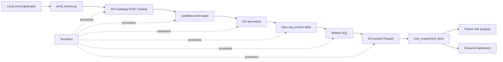

# Architecture Diagram

## Responsibilities

- Terraform provisions cloud infrastructure and IAM.
- API Gateway and Lambda create the event ingestion surface.
- S3 stores raw and curated data lake files.
- Glue describes S3 data to Athena.
- Athena transforms raw JSON events into curated Parquet facts.
- Python and Streamlit turn curated facts into experiment decisions.
